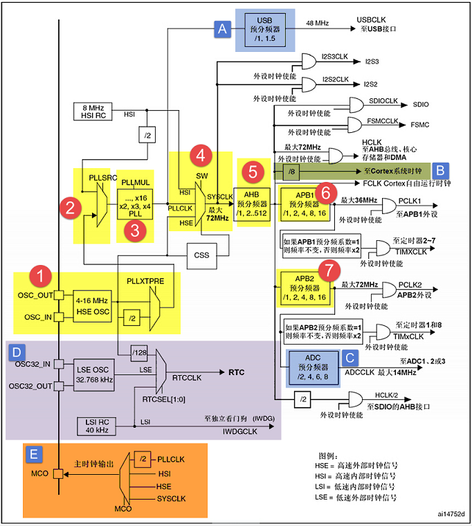

# 32学习整理记录（旋）

# 一、STM32 点灯- GPIO & RCC 快速参考

---

## 1. RCC_APB2ENR — APB2 外设时钟使能寄存器（为什么要用它？）

用途：控制 APB2 总线上外设（包括 GPIOA~G、AFIO、ADC1、USART1 等）的时钟使能。外设时钟未使能时，外设寄存器读写通常无效或不可预测。

**重要位（常用，位号从 0 开始）：**

- bit 0 — AFIOEN：复用/中断功能控制器时钟（Alternate function IO）。若要使用外部中断/复用功能，需使能。
- bit 2 — IOPAEN：GPIOA 时钟使能（1 = 使能）
- bit 3 — IOPBEN：GPIOB 时钟使能
- bit 4 — IOPCEN：GPIOC 时钟使能
- bit 5 — IOPDEN：GPIOD 时钟使能
- bit 6 — IOPEEN：GPIOE 时钟使能  
（若 MCU 有更多端口，会按位继续）

**如何操作：**

```c
// 使能端口 X 的时钟
RCC->APB2ENR |= (1 << n);  // n 为对应位号，例如 GPIOB 是 3

// 关闭端口 X 的时钟
RCC->APB2ENR &= ~(1 << n);
```

## 2. GPIOx_CRL / GPIOx_CRH — 端口配置寄存器（低/高）

用途：配置每个引脚的模式（输入/输出/复用/模拟）与输出速度/类型。

- CRL：控制端口的 Pin 0..7（每个 pin 占 4 位）  
- CRH：控制端口的 Pin 8..15（每个 pin 占 4 位）

每个 pin 的 4 位格式（低位在前）：

```c

bit[3:0] = CNF1 CNF0 MODE1 MODE0

```


**MODE 含义（输出模式时）：**

- 00 = 输入模式（当 CNF 表示输入时）  
- 01 = 输出模式，最大 10 MHz  
- 10 = 输出模式，最大 2 MHz  
- 11 = 输出模式，最大 50 MHz  

**CNF 含义：**

- 输入（MODE=00）  
  - 00 = 模拟输入（AIN）  
  - 01 = 浮空输入（IN_FLOATING）  
  - 10 = 输入带下拉（IPD）  
  - 11 = 输入带上拉（IPU）  

- 输出（MODE≠00）  
  - 00 = 普通推挽输出（General purpose output push-pull）  
  - 01 = 推挽复用（依手册）  
  - 10 = 开漏输出（Open-drain）  
  - 11 = 复用推挽（AF push-pull）  

**如何操作（示例：配置 pin n）：**

```c
// 偏移计算
int offset = (n % 8) * 4; // 若 n < 8 用 CRL，否则用 CRH 并减 8

// 清 4 位
GPIOx_CRL &= ~(0xF << offset);

// 写入需要的值
GPIOx_CRL |= (value << offset); // value = (CNF<<2 | MODE)

```
例子（PB0 推挽输出 10MHz）：
```c
// 配置 PB0
int MODE = 0x1;  // 01 -> 10MHz
int CNF  = 0x0;  // 00 -> 推挽
int value = (CNF << 2) | MODE;

GPIOB->CRL &= ~(0xF << (0*4));
GPIOB->CRL |= (value << (0*4));
```
# STM32 GPIO 快速参考

---

## 3. GPIOx_IDR — 输入数据寄存器（Input Data Register）

用途：读取端口引脚的实时输入电平（只读寄存器）。

**示例操作：**  

```c
// 读取单个引脚 y
if (GPIOB->IDR & (1 << y)) {
    // Py = 高
} else {
    // Py = 低
}

// 读取全部 16 位
uint16_t all = GPIOB->IDR;
```
## 4. GPIOx_ODR — 输出数据寄存器（Output Data Register）

用途：用途：非原子地读/写 GPIO 输出值。

**示例操作：**  
```c
// 设置 Py = 1
GPIOB->ODR |= (1 << y);

// 清除 Py = 0
GPIOB->ODR &= ~(1 << y);
```
## 5. GPIOx_BSRR — 原子置位/复位寄存器（Bit Set/Reset Register）

用途：原子操作设置或清除单个引脚，避免中断竞争。

**示例操作：**  

```c
// PB5 = 1
GPIOB->BSRR = (1 << 5);

// PB5 = 0
GPIOB->BSRR = (1 << (5 + 16));
```

## 6. GPIOx_BRR — 复位寄存器（Bit Reset Register，旧版）
示例操作
```c
GPIOB->BRR = (1 << 5); // PB5 = 0
```

## 7. GPIOx_LCKR — 配置锁定寄存器（Lock Register）

用途：锁定 CRL/CRH 配置，防止意外修改，直到 MCU 复位。

锁定序列

```c
GPIOB->LCKR = (1 << 0) | (1 << 16); // LCKy=1, LCKK=1
GPIOB->LCKR = (1 << 16);            // LCKK=1
volatile uint32_t tmp = GPIOB->LCKR; // 读 LCKK 判断锁定
```

## 8. 常见位操作技巧
```c
// 清 + 写
GPIOx_CRL &= ~(0xF << offset);
GPIOx_CRL |=  (value << offset);

// 输出原子控制
GPIOx->BSRR = (1 << pin);        // 置 1
GPIOx->BSRR = (1 << (pin + 16)); // 置 0

// 读取单引脚
bool high = GPIOx->IDR & (1 << pin);
```
## 9. 完整寄存器点亮 LED 例子
```c
#define PERIPH_BASE         ((unsigned int)0x40000000UL)
#define APB2PERIPH_BASE     (PERIPH_BASE + 0x10000UL)
#define AHBPERIPH_BASE      (PERIPH_BASE + 0x20000UL)

#define GPIOB_BASE          (APB2PERIPH_BASE + 0x0C00UL)
#define RCC_BASE            (AHBPERIPH_BASE  + 0x1000UL)

#define GPIOB_CRL           (*(volatile unsigned int *)(GPIOB_BASE + 0x00UL))
#define GPIOB_CRH           (*(volatile unsigned int *)(GPIOB_BASE + 0x04UL))
#define GPIOB_IDR           (*(volatile unsigned int *)(GPIOB_BASE + 0x08UL))
#define GPIOB_ODR           (*(volatile unsigned int *)(GPIOB_BASE + 0x0CUL))
#define GPIOB_BSRR          (*(volatile unsigned int *)(GPIOB_BASE + 0x10UL))
#define GPIOB_BRR           (*(volatile unsigned int *)(GPIOB_BASE + 0x14UL))
#define GPIOB_LCKR          (*(volatile unsigned int *)(GPIOB_BASE + 0x18UL))

#define RCC_APB2ENR         (*(volatile unsigned int *)(RCC_BASE + 0x18UL))

void delay(volatile unsigned int t) { while(t--) __asm__("nop"); }

int main(void)
{
    RCC_APB2ENR |= (1U << 3);           // 使能 GPIOB 时钟

    GPIOB_CRL &= ~(0xFUL << 0);         // PB0 清原配置
    GPIOB_CRL |=  (0x1UL << 0);         // PB0 推挽、10MHz

    GPIOB_BSRR = (1U << (0 + 16));      // PB0=0 → LED亮（低电平点亮）

    while (1)
    {
        GPIOB_BSRR = (1U << 0);         // PB0=1 → LED灭
        delay(500000);

        GPIOB_BSRR = (1U << (0 + 16));  // PB0=0 → LED亮
        delay(500000);

        if (GPIOB_IDR & (1U << 0))
        {
            // PB0 = high
        }
        else
        {
            // PB0 = low
        }
    }
}
```

## 10. 进阶 QA

### Q：为什么必须先使能 RCC？
**A：** GPIO 时钟未开 → CRL/CRH 写入无效。

### Q：为什么 BSRR 比 ODR 好？
**A：** 原子操作，避免中断竞争。

### Q：输入上拉/下拉怎么配？
**A：** MODE=00，CNF=10（下拉）/11（上拉），再通过 ODR 决定上下拉。

### Q：多个引脚如何一次配置？
**A：** 统一计算掩码后一次写入，避免多次读改写。


# 二、自己写库—构建库函数雏形

**参考资料**：《STM32F10X-中文参考手册》GPIO与RCC章节。

使用寄存器直接控制 STM32 外设虽然简单，但容易出错、代码难懂且不利于维护。学习 STM32 最好的方法是先了解库的使用，再深入底层寄存器实现。

## 1.1 什么是 STM32 函数库

STM32 标准函数库是 ST 公司提供的 API 接口，开发者通过调用这些函数操作寄存器，而无需直接操作寄存器。

### 优点

- **快速开发**  
- **易读性好**  
- **维护成本低**

库的底层实现本质上是对寄存器的操作，是学习寄存器的最佳参考。

**总结**：库是寄存器与应用层之间的桥梁。用户调用 API 无需关心寄存器细节，而想深入了解可查看库源码。

## 1.2 为什么采用库开发

### 直接配置寄存器的缺陷

- 开发速度慢 
- 程序可读性差  
- 维护复杂

### 库开发优势

- 易于理解和维护  
- 支持快速开发  
- STM32 资源丰富：牺牲一点 CPU 资源换取开发效率是合理的

### 何时使用直接寄存器？

对执行效率要求极高的场合，例如频繁调用的中断服务函数

# 1.3 构建GPIO库函数

目标：将GPIO寄存器操作封装为函数，方便调用。

## 1.3.1 外设寄存器结构体定义
每个GPIO寄存器地址是基于外设基地址的偏移，可用结构体映射寄存器。
**示例：**
```c
typedef struct
{
    __IO uint32_t CRL;   // 端口配置低寄存器
    __IO uint32_t CRH;   // 端口配置高寄存器
    __IO uint32_t IDR;   // 输入数据寄存器
    __IO uint32_t ODR;   // 输出数据寄存器
    __IO uint32_t BSRR;  // 位设置/清除寄存器
    __IO uint32_t BRR;   // 位清除寄存器
    __IO uint32_t LCKR;  // 端口锁定寄存器
} GPIO_TypeDef;
```
 **__IO 等同于 volatile，确保寄存器值每次都重新读取，防止**

## 1.3.2 外设存储器映射
定义外设基地址：
```c
#define PERIPH_BASE       0x40000000
#define APB2PERIPH_BASE   (PERIPH_BASE + 0x10000)
#define AHBPERIPH_BASE    (PERIPH_BASE + 0x20000)

#define GPIOA_BASE        (APB2PERIPH_BASE + 0x0800)
#define RCC_BASE          (AHBPERIPH_BASE + 0x1000)
```

## 1.3.3 外设声明

将基地址强制转换为结构体指针：
```c
#define GPIOA ((GPIO_TypeDef*)GPIOA_BASE)
#define RCC   ((RCC_TypeDef*)RCC_BASE)
```

使用指针即可直接操作寄存器，例如：
```c
RCC->APB2ENR |= (1<<3); // 开启GPIOB时钟
```
## 1.3.4 位操作函数

设置高电平 / 低电平：
```c
void GPIO_SetBits(GPIO_TypeDef* GPIOx, uint16_t GPIO_Pin) {
    GPIOx->BSRR = GPIO_Pin;
}

void GPIO_ResetBits(GPIO_TypeDef* GPIOx, uint16_t GPIO_Pin) {
    GPIOx->BRR = GPIO_Pin;
}
```

使用宏定义引脚号：
```c
#define GPIO_Pin_0 ((uint16_t)0x0001)
#define GPIO_Pin_1 ((uint16_t)0x0002)
// ...
#define GPIO_Pin_All ((uint16_t)0xFFFF)
```

使用示例：
```c
GPIO_SetBits(GPIOB, GPIO_Pin_10 | GPIO_Pin_11);  // 高电平
GPIO_ResetBits(GPIOB, GPIO_Pin_10 | GPIO_Pin_11); // 低电平
```
## 1.3.5 GPIO初始化结构体
```c
typedef struct
{
    uint16_t GPIO_Pin;      // 引脚号
    GPIOSpeed_TypeDef GPIO_Speed;  // 输出速率
    GPIOMode_TypeDef GPIO_Mode;    // 引脚模式
} GPIO_InitTypeDef;
```

## 1.3.6 GPIO模式枚举
```c
typedef enum { GPIO_Speed_10MHz=1, GPIO_Speed_2MHz, GPIO_Speed_50MHz } GPIOSpeed_TypeDef;

typedef enum {
    GPIO_Mode_AIN=0x0, GPIO_Mode_IN_FLOATING=0x04, GPIO_Mode_IPD=0x28,
    GPIO_Mode_IPU=0x48, GPIO_Mode_Out_OD=0x14, GPIO_Mode_Out_PP=0x10,
    GPIO_Mode_AF_OD=0x1C, GPIO_Mode_AF_PP=0x18
} GPIOMode_TypeDef;
```

枚举类型方便对输入参数进行限定，避免错误。

## 1.3.7 GPIO初始化函数
```c
void GPIO_Init(GPIO_TypeDef* GPIOx, GPIO_InitTypeDef* GPIO_InitStruct) {
    // 1. 判断输出/输入模式
    // 2. 设置输出速率（输出模式）
    // 3. 配置CRL寄存器（Pin0~7）
    // 4. 配置CRH寄存器（Pin8~15）
    // 5. 上拉/下拉输入通过BSRR/BRR寄存器设置默认值
}
```

核心思想：根据结构体内容自动写寄存器，用户无需手动查寄存器说明。

## 1.3.8 使用函数点亮LED
```c
GPIO_InitTypeDef GPIO_InitStructure;
RCC_APB2ENR |= (1<<3);              // 开启GPIOB时钟
GPIO_InitStructure.GPIO_Pin = GPIO_Pin_0;
GPIO_InitStructure.GPIO_Mode = GPIO_Mode_Out_PP;
GPIO_InitStructure.GPIO_Speed = GPIO_Speed_50MHz;
GPIO_Init(GPIOB, &GPIO_InitStructure);

while(1) {
    GPIO_ResetBits(GPIOB, GPIO_Pin_0); // 点亮LED
    Delay(0xFFFF);
    GPIO_SetBits(GPIOB, GPIO_Pin_0);   // 熄灭LED
    Delay(0xFFFF);
}
```
使用库函数，main函数逻辑清晰，无需关心寄存器位细节。

##1.4完整代码

#库头文件 stm32f10x_gpio.h
```c
#ifndef __STM32F10X_GPIO_H
#define __STM32F10X_GPIO_H

#include "stdint.h"

// IO定义
#define __IO volatile

// 1. 外设寄存器结构体
typedef struct
{
    __IO uint32_t CRL;   // 端口配置低寄存器 Pin0~7
    __IO uint32_t CRH;   // 端口配置高寄存器 Pin8~15
    __IO uint32_t IDR;   // 输入数据寄存器
    __IO uint32_t ODR;   // 输出数据寄存器
    __IO uint32_t BSRR;  // 位设置/清除寄存器
    __IO uint32_t BRR;   // 位清除寄存器
    __IO uint32_t LCKR;  // 端口锁定寄存器
} GPIO_TypeDef;

// 2. 外设基地址映射
#define PERIPH_BASE       0x40000000
#define APB2PERIPH_BASE   (PERIPH_BASE + 0x10000)
#define AHBPERIPH_BASE    (PERIPH_BASE + 0x20000)

#define GPIOA_BASE        (APB2PERIPH_BASE + 0x0800)
#define GPIOB_BASE        (APB2PERIPH_BASE + 0x0C00)
#define RCC_BASE          (AHBPERIPH_BASE + 0x1000)

// 3. 外设声明
#define GPIOA ((GPIO_TypeDef*)GPIOA_BASE)
#define GPIOB ((GPIO_TypeDef*)GPIOB_BASE)

// RCC寄存器结构体（只包含APB2ENR）
typedef struct
{
    __IO uint32_t CR;
    __IO uint32_t CFGR;
    __IO uint32_t CIR;
    __IO uint32_t APB2RSTR;
    __IO uint32_t APB1RSTR;
    __IO uint32_t AHBENR;
    __IO uint32_t APB2ENR;  // 外设时钟使能寄存器
    __IO uint32_t APB1ENR;
    __IO uint32_t BDCR;
    __IO uint32_t CSR;
} RCC_TypeDef;

#define RCC ((RCC_TypeDef*)RCC_BASE)

// 4. 位操作宏
#define GPIO_Pin_0  ((uint16_t)0x0001)
#define GPIO_Pin_1  ((uint16_t)0x0002)
#define GPIO_Pin_2  ((uint16_t)0x0004)
#define GPIO_Pin_3  ((uint16_t)0x0008)
#define GPIO_Pin_4  ((uint16_t)0x0010)
#define GPIO_Pin_5  ((uint16_t)0x0020)
#define GPIO_Pin_6  ((uint16_t)0x0040)
#define GPIO_Pin_7  ((uint16_t)0x0080)
#define GPIO_Pin_8  ((uint16_t)0x0100)
#define GPIO_Pin_9  ((uint16_t)0x0200)
#define GPIO_Pin_10 ((uint16_t)0x0400)
#define GPIO_Pin_11 ((uint16_t)0x0800)
#define GPIO_Pin_12 ((uint16_t)0x1000)
#define GPIO_Pin_13 ((uint16_t)0x2000)
#define GPIO_Pin_14 ((uint16_t)0x4000)
#define GPIO_Pin_15 ((uint16_t)0x8000)
#define GPIO_Pin_All ((uint16_t)0xFFFF)

// 5. GPIO速度枚举
typedef enum { GPIO_Speed_10MHz=1, GPIO_Speed_2MHz, GPIO_Speed_50MHz } GPIOSpeed_TypeDef;

// 6. GPIO模式枚举
typedef enum {
    GPIO_Mode_AIN=0x0, GPIO_Mode_IN_FLOATING=0x04, GPIO_Mode_IPD=0x28,
    GPIO_Mode_IPU=0x48, GPIO_Mode_Out_OD=0x14, GPIO_Mode_Out_PP=0x10,
    GPIO_Mode_AF_OD=0x1C, GPIO_Mode_AF_PP=0x18
} GPIOMode_TypeDef;

// 7. GPIO初始化结构体
typedef struct
{
    uint16_t GPIO_Pin;         // 引脚号
    GPIOSpeed_TypeDef GPIO_Speed;  // 输出速率
    GPIOMode_TypeDef GPIO_Mode;    // 引脚模式
} GPIO_InitTypeDef;

// 8. 函数声明
void GPIO_SetBits(GPIO_TypeDef* GPIOx, uint16_t GPIO_Pin);
void GPIO_ResetBits(GPIO_TypeDef* GPIOx, uint16_t GPIO_Pin);
void GPIO_Init(GPIO_TypeDef* GPIOx, GPIO_InitTypeDef* GPIO_InitStruct);

#endif
```
## 1.4.2库源文件 stm32f10x_gpio.c
```c
#include "stm32f10x_gpio.h"

// 设置引脚高电平
void GPIO_SetBits(GPIO_TypeDef* GPIOx, uint16_t GPIO_Pin) {
    GPIOx->BSRR = GPIO_Pin;
}

// 设置引脚低电平
void GPIO_ResetBits(GPIO_TypeDef* GPIOx, uint16_t GPIO_Pin) {
    GPIOx->BRR = GPIO_Pin;
}

// 初始化GPIO
void GPIO_Init(GPIO_TypeDef* GPIOx, GPIO_InitTypeDef* GPIO_InitStruct) {
    uint32_t pinpos = 0, pos = 0, temp = 0;
    uint16_t pinmask = 0;

    for (pinpos = 0; pinpos < 16; pinpos++) {
        pinmask = (1 << pinpos);
        if (GPIO_InitStruct->GPIO_Pin & pinmask) {
            if (pinpos < 8) {
                pos = pinpos * 4;
                temp = GPIOx->CRL;
                temp &= ~(0xF << pos);
                temp |= (GPIO_InitStruct->GPIO_Mode | GPIO_InitStruct->GPIO_Speed) << pos;
                GPIOx->CRL = temp;
            } else {
                pos = (pinpos - 8) * 4;
                temp = GPIOx->CRH;
                temp &= ~(0xF << pos);
                temp |= (GPIO_InitStruct->GPIO_Mode | GPIO_InitStruct->GPIO_Speed) << pos;
                GPIOx->CRH = temp;
            }

            // 上拉/下拉输入默认值
            if (GPIO_InitStruct->GPIO_Mode == GPIO_Mode_IPU) {
                GPIOx->BSRR = pinmask; // 上拉
            } else if (GPIO_InitStruct->GPIO_Mode == GPIO_Mode_IPD) {
                GPIOx->BRR = pinmask;  // 下拉
            }
        }
    }
}
```

## 1.4.3用户应用文件 main.c
```c
#include "stm32f10x_gpio.h"

// 简单延时函数
void Delay(uint32_t count) {
    while(count--) __asm("nop");
}

int main(void) {
    GPIO_InitTypeDef GPIO_InitStructure;

    // 1. 开启GPIOB时钟
    RCC->APB2ENR |= (1<<3);

    // 2. 配置PB0为推挽输出，50MHz
    GPIO_InitStructure.GPIO_Pin = GPIO_Pin_0;
    GPIO_InitStructure.GPIO_Mode = GPIO_Mode_Out_PP;
    GPIO_InitStructure.GPIO_Speed = GPIO_Speed_50MHz;
    GPIO_Init(GPIOB, &GPIO_InitStructure);

    while(1) {
        GPIO_ResetBits(GPIOB, GPIO_Pin_0); // 点亮LED
        Delay(0xFFFF);
        GPIO_SetBits(GPIOB, GPIO_Pin_0);   // 熄灭LED
        Delay(0xFFFF);
    }
}
```

# 3.GPIO标准库的学习
## 1) void GPIO_DeInit(GPIO_TypeDef* GPIOx);
### 作用
将指定 GPIO 外设相关寄存器恢复到复位值：CRL、CRH、IDR（读只）、ODR（一般为 0x0000）、BSRR/BRR 清空，LCKR 恢复等。实现通常通过把对应 RCC 外设复位位拉高再清零（软件复位）。
### 寄存器/操作
相当于对该端口做一次外设复位（通过 RCC APB2RSTR 写 1 然后写 0）。
### 陷阱/注意
- 会清除引脚上的所有配置（包括上拉/下拉、输出模式、速度等），如果其他模块（比如外设）依赖这些引脚，要谨慎调用。

- 不会影响 AFIO 的重映射（AFIO 是独立的），除非也调用 GPIO_AFIODeInit()。
### 实例代码
```c
// 恢复 GPIOA 到复位态
GPIO_DeInit(GPIOA);
```

## 2) void GPIO_AFIODeInit(void);
### 作用
把 AFIO 外设（复用与 EXTI 源选择）的寄存器恢复到复位值：AFIO->MAPR = 0x00000000; AFIO->EXTICR[x] = 0x00000000; AFIO->EVCR = 0x00000000 等。
### 寄存器/操作
清除 AFIO_MAPR（包括引脚重映射、SWJ/JTAG 配置、CAN/PWM remap 等）与 AFIO_EXTICR（EXTI 源映射）。
### 陷阱/注意
调用后会恢复 JTAG/SWD 为默认配置（通常开启 JTAG），会影响原来做过的重映射与 EXTI 配置。
### 实例代码
```c
GPIO_AFIODeInit(); // 还原 AFIO 至出厂配置

```

## 3) void GPIO_DeInit(GPIO_TypeDef* GPIOx);
### 作用
按 GPIO_InitTypeDef 填写 CRL/CRH 对应 4-bit 字段，设置模式与配置（输入浮空、模拟、上拉/下拉/推挽输出/开漏/复用推挽 等）和速度（输出时）。
### 关键细节（位级）

- 每 pin 占 4-bit。在 CRL 控制 pin0..7，CRH 控制 pin8..15。每 4 bit = [CNF1 CNF0 MODE1 MODE0]（具体位序按 RM）。

- 对于输入上拉/下拉，库会写 ODR 的相应位（上拉写 1，下拉写 0）并将模式设置为输入浮空/带上下拉（CNF）。

### 实现顺序建议

- 1先使能 RCC 对应 GPIO 时钟（RCC_APB2PeriphClockCmd(RCC_APB2Periph_GPIOA, ENABLE)）。

- 2调整 GPIO_InitStruct 内容。

- 3调用 GPIO_Init()。

### 常见错误

- 忘记打开 GPIO 时钟 → 写 CRL/CRH 无效或总线错误（取决编译器/硬件）。

- 试图在被锁定的 pin 上写配置（会失效）。

### 实例代码(输出推挽）
```c
RCC_APB2PeriphClockCmd(RCC_APB2Periph_GPIOA, ENABLE);

GPIO_InitTypeDef GPIO_InitStructure;
GPIO_InitStructure.GPIO_Pin = GPIO_Pin_5;
GPIO_InitStructure.GPIO_Speed = GPIO_Speed_50MHz;
GPIO_InitStructure.GPIO_Mode = GPIO_Mode_Out_PP; // 推挽输出
GPIO_Init(GPIOA, &GPIO_InitStructure);
```
### 实例代码（输出上拉）
```c
GPIO_InitStructure.GPIO_Pin = GPIO_Pin_0;
GPIO_InitStructure.GPIO_Mode = GPIO_Mode_IPU; // 输入上拉
GPIO_Init(GPIOA, &GPIO_InitStructure);
```

## 4) void GPIO_StructInit(GPIO_InitTypeDef* GPIO_InitStruct);
### 作用
把结构体字段填成库定义的默认值（通常 GPIO_Pin = All, GPIO_Mode = GPIO_Mode_IN_FLOATING, GPIO_Speed = GPIO_Speed_2MHz 或类似）。目的是保证未赋值字段有确定值，避免随机行为。
### 实例
```c
GPIO_InitTypeDef GPIO_InitStructure;
GPIO_StructInit(&GPIO_InitStructure);
// 现在可以修改需要更改的字段再调用 GPIO_Init()
GPIO_InitStructure.GPIO_Pin = GPIO_Pin_1;
GPIO_InitStructure.GPIO_Mode = GPIO_Mode_Out_OD;
GPIO_InitStructure.GPIO_Speed = GPIO_Speed_10MHz;
GPIO_Init(GPIOB, &GPIO_InitStructure);
```

## 5) uint8_t GPIO_ReadInputDataBit(GPIO_TypeDef* GPIOx, uint16_t GPIO_Pin);
### 作用
读取 GPIOx->IDR 的单个位并返回 0 或 1。GPIO_Pin 为等价的 bit mask（GPIO_Pin_0=0x0001 ... GPIO_Pin_15=0x8000）。实现是 return (uint8_t)((GPIOx->IDR & GPIO_Pin) != 0);

### 注意
- 读取的是引脚的实际物理电平（受外部驱动影响），与 ODR 不一定一致（例如外部把线拉低而 ODR 写 1 时）。

- 对浮空输入，读值不稳定（可能噪声跳变）。
### 实例
```c
if (GPIO_ReadInputDataBit(GPIOA, GPIO_Pin_0) == 1) {
    // PA0 为高电平
}
```

## 6) uint16_t GPIO_ReadInputData(GPIO_TypeDef* GPIOx);
### 作用
返回 GPIOx->IDR & 0xFFFF，即端口全部 16 个引脚的当前输入电平组合，常用于读取矩阵键盘或多个并联输入。

### 实例
```c
uint16_t val = GPIO_ReadInputData(GPIOB);
// bit0 对应 PB0, bit1 PB1 ...

```

## 7) uint8_t GPIO_ReadOutputDataBit(GPIO_TypeDef* GPIOx, uint16_t GPIO_Pin);
### 作用
读取 GPIOx->ODR 对应位（输出寄存器），返回软件写入的输出状态（0/1）。实现 return (uint8_t)((GPIOx->ODR & GPIO_Pin) != 0);
### 注意

- 如果引脚被外部短接到地或外部器件拉高，这个 API 仍返回 ODR 中的值，不是实际电平。

- 对用于读取输出 latch 状态很有用（确认我们软件写入了什么），但不能代替 IDR 检测外部冲突。

### 实例
```c
if (GPIO_ReadOutputDataBit(GPIOA, GPIO_Pin_5))
    ; // 我们写了高
```
## 8) uint16_t GPIO_ReadOutputData(GPIO_TypeDef* GPIOx);

### 作用
返回 GPIOx->ODR & 0xFFFF。常用于一次读取端口输出 latch 的值。

## 9) void GPIO_SetBits(GPIO_TypeDef* GPIOx, uint16_t GPIO_Pin);

### 作用
把 GPIO_Pin 指定的位置 1。实现通过 GPIOx->BSRR = GPIO_Pin; （在 F1 上写低 16 位置位，写高 16 位复位）。写 BSRR 是原子操作（对中断安全特别好），不会影响其它位。

### 注意

- 使用 BSRR 可以避免读-改-写 ODR 带来的竞争条件。

- GPIO_Pin 可以是多个位的按位或（如 GPIO_Pin_0 | GPIO_Pin_4）。

### 示例
```c
GPIO_SetBits(GPIOA, GPIO_Pin_5); // 原子将 PA5 置 1
// 同时置 PA5 和 PA6:
GPIO_SetBits(GPIOA, GPIO_Pin_5 | GPIO_Pin_6);
```

## 10) void GPIO_ResetBits(GPIO_TypeDef* GPIOx, uint16_t GPIO_Pin);

### 作用
把 GPIO_Pin 指定的位复位为 0。实现常为 GPIOx->BRR = GPIO_Pin; 或 GPIOx->BSRR = (uint32_t)GPIO_Pin << 16;（两种写法等效，取决芯片）。

###示例
```c
GPIO_ResetBits(GPIOA, GPIO_Pin_5); // 原子将 PA5 清 0
```

## 11) void GPIO_WriteBit(GPIO_TypeDef* GPIOx, uint16_t GPIO_Pin, BitAction BitVal);

### 作用
根据 BitVal（Bit_SET 或 Bit_RESET）选择调用 BSRR 或 BRR。即封装了 Set/Reset 操作。

### 示例
```c
GPIO_WriteBit(GPIOA, GPIO_Pin_5, Bit_SET);   // 等同于 GPIO_SetBits
GPIO_WriteBit(GPIOA, GPIO_Pin_5, Bit_RESET); // 等同于 GPIO_ResetBits
```
## 12) void GPIO_Write(GPIO_TypeDef* GPIOx, uint16_t PortVal);

### 作用
直接写 GPIOx->ODR = PortVal; 这样的操作会覆盖 ODR 的所有位（0..15）。不是原子操作（写入整个寄存器，但实际上是单次寄存器写，依旧会被中断打断），对并发访问要小心。

### 注意

若用于多个任务/中断共享同一端口，多写可能干扰其它 pin 的状态，除非你在写前读 ODR 做掩码处理（但那是读改写，非原子）。

### 示例
```c
GPIO_Write(GPIOB, 0x55AA); // 直接写入 PB0..PB15 的输出 latch
```
## 13) void GPIO_PinLockConfig(GPIO_TypeDef* GPIOx, uint16_t GPIO_Pin);

### 作用（更细）
- 对某些 pin 的 CRL/CRH 配置进行锁定，使用 LCKR 的锁定序列。锁定成功后，这些 pin 的配置位不能被改写，直到复位。

### 锁定时序（必须严格按步骤）

- 1写 GPIOx->LCKR = LCKK(1) | GPIO_PinMask;（其中 LCKK=1 表示 lock key）

- 2写 GPIOx->LCKR = GPIO_PinMask;（LCKK=0）

- 3再写 GPIOx->LCKR = LCKK(1) | GPIO_PinMask;（LCKK=1）

- 4读取 GPIOx->LCKR 两次，确认 LCKK 置位（读后 LCKK=1 表示锁定成功）。

### 实现细节
StdPeriph 库把上面步骤封装在 GPIO_PinLockConfig() 中。

### 陷阱

- 如果不按顺序或读写不配合，锁定可能失败。

- 锁定不可逆（直到芯片复位）。谨慎对待关键引脚。

### 示例
```c
// 锁定 PA0 和 PA1 的配置
GPIO_PinLockConfig(GPIOA, GPIO_Pin_0 | GPIO_Pin_1);
```
## 14) void GPIO_EventOutputConfig(uint8_t GPIO_PortSource, uint8_t GPIO_PinSource);

### 作用
配置 AFIO 的 EVCR（Event Control Register）或 MAPR 中与 Event Output 相关位以选择哪一引脚作为 Event Output（事件输出）。Event Output 是把一个 GPIO 事件广播到系统（可被调试或其它外设感知），常用于低功耗唤醒或调试同步。

### 参数

GPIO_PortSource（端口编号，通常 0=A,1=B...）

GPIO_PinSource（引脚编号 0..15）

### 示例
```c
// 配置事件输出为 PA0
GPIO_EventOutputConfig(GPIO_PortSourceGPIOA, GPIO_PinSource0);
GPIO_EventOutputCmd(ENABLE);
```
## 15) void GPIO_EventOutputCmd(FunctionalState NewState);

### 作用
使能/失能 Event Output；实际上操作 AFIO 的 EVCR 或 MAPR 中的相关 enable 位。ENABLE 时会把之前选定的 pin 的变化产生事件输出。

### 示例
```c
GPIO_EventOutputCmd(ENABLE);
```
## 16) void GPIO_PinRemapConfig(uint32_t GPIO_Remap, FunctionalState NewState);

### 作用
控制 AFIO->MAPR（或 MAPR2）的具体位来启用/关闭某个外设的引脚重映射。例如把 USART1 从 PA9/PA10 重映射到 PB6/PB7、或禁用 JTAG（使能 SWD-only）等。GPIO_Remap 是库中定义的宏（例如 GPIO_Remap_SWJ_JTAGDisable、GPIO_Remap_USART1 等）。

### 寄存器/位

AFIO->MAPR 包含很多 remap 位，按 RM（参考手册）为位域或位掩码。库函数会根据 NewState 把对应位或清除。

### 陷阱

某些重映射是互斥的（只能选一个模式）。调用前查 RM 或 stm32f10x_gpio.h 中的宏说明。

改变重映射后，相关外设初始化（如 USART_Init）应在 remap 后或确保 remap 生效时做。

### 示例
```c
// 禁用 JTAG，只保留 SWD（释放 PB3/PB4/PA15）
GPIO_PinRemapConfig(GPIO_Remap_SWJ_JTAGDisable, ENABLE);

// 将 TIM2 的通道 1 重映射到另一路径
GPIO_PinRemapConfig(GPIO_Remap_TIM2, ENABLE);
```
## 17) void GPIO_EXTILineConfig(uint8_t GPIO_PortSource, uint8_t GPIO_PinSource);

### 作用
设置 AFIO 的 EXTICR[n] 寄存器来选择 EXTI 线 0..15 的端口来源（例如 EXTI0 可以来自 PA0 或 PB0 或 PC0 ...）。GPIO_PortSource 是端口索引（0..7），GPIO_PinSource 表示哪条 EXTI 线（0..15）。

### 寄存器/位

AFIO->EXTICR[pin/4] 每 4 个 pin 使用 4-bit 字段来选择端口来源。

### 示例
```c
// 将 EXTI0 源设为 PB0
GPIO_EXTILineConfig(GPIO_PortSourceGPIOB, GPIO_PinSource0);

// 然后设置 EXTI 中断/触发
EXTI_InitStructure.EXTI_Line = EXTI_Line0;
EXTI_InitStructure.EXTI_Mode = EXTI_Mode_Interrupt;
EXTI_InitStructure.EXTI_Trigger = EXTI_Trigger_Rising;
EXTI_InitStructure.EXTI_LineCmd = ENABLE;
EXTI_Init(&EXTI_InitStructure);
```

### 注意

设置 EXTI 源只是连接 AFIO；还需配置 EXTI->IMR/EMR、触发方式与 NVIC 使能中断。

## 18) void GPIO_ETH_MediaInterfaceConfig(uint32_t GPIO_ETH_MediaInterface);

### 作用
配置 MAC/PHY 之间的接口类型（在有以太网 MAC 的芯片上，如 STM32F107）：MII 模式或 RMII 模式。底层操作是设置 AFIO->MAPR 中 ETH 接口相关位，从而连接不同的 MAC 引脚组合和 PHY 时钟。

### 参数

GPIO_ETH_MediaInterface_MII 或 GPIO_ETH_MediaInterface_RMII（库宏）

### 影响

会影响引脚重映射（比如 PHY TX/RX 引脚、MDC/MDIO、REFCLK 等），因此必须在 ETH 外设初始化前配置好。
### 
示例
```c
// 将以太网接口配置为 RMII 模式（PHY 必须支持 RMII）
GPIO_ETH_MediaInterfaceConfig(GPIO_ETH_MediaInterface_RMII);
```
# 四、简单的流水灯代码
main.c
```c
#include "main.h"
#include "stm32f10x.h"
#include "delay/bsp_delay.h"
#include "led/bsp_gpio_led.h"

/**
  * @brief  主函数
  * @param  无 
  * @note   无
  * @retval 无
  */
int main(void)
{
    uint32_t time_temp  = 1000;
    
    LED_GPIO_Config();

    while(1)
    {
        R_LED_ON_ONLY;
        Rough_Delay_Ms(time_temp);
        
        G_LED_ON_ONLY;
        Rough_Delay_Ms(time_temp);
        
        B_LED_ON_ONLY;
        Rough_Delay_Ms(time_temp);
        
        R_G_B_ALL_ON;
        Rough_Delay_Ms(time_temp);
        R_G_B_ALL_OFF;
        Rough_Delay_Ms(time_temp);
        
        R_G_B_ALL_ON;
        Rough_Delay_Ms(time_temp);
        R_G_B_ALL_OFF;
        Rough_Delay_Ms(time_temp);
        
        R_G_B_ALL_ON;
        Rough_Delay_Ms(time_temp);
        R_G_B_ALL_OFF;
        Rough_Delay_Ms(time_temp);
        
    
    }
        
}
```

bsp_gpio.c
```c  
#include "led/bsp_gpio_led.h"

void LED_GPIO_Config(void)
{
    GPIO_InitTypeDef gpio_initstruct = {0};
    
    //开启端口时钟
    RCC_APB2PeriphClockCmd(R_LED_GPIO_CLK_PORT,ENABLE);
    RCC_APB2PeriphClockCmd(G_LED_GPIO_CLK_PORT,ENABLE);
    RCC_APB2PeriphClockCmd(B_LED_GPIO_CLK_PORT,ENABLE);
    
    
    //关闭灯
    GPIO_SetBits(R_LED_GPIO_PORT,R_LED_GPIO_PIN);
    GPIO_SetBits(G_LED_GPIO_PORT,G_LED_GPIO_PIN);
    GPIO_SetBits(B_LED_GPIO_PORT,B_LED_GPIO_PIN);

    
    //配置io模式 推挽模式，50m
    gpio_initstruct.GPIO_Mode = GPIO_Mode_Out_PP;
    gpio_initstruct.GPIO_Pin = R_LED_GPIO_PIN;
    gpio_initstruct.GPIO_Speed = GPIO_Speed_50MHz;
    GPIO_Init(R_LED_GPIO_PORT,&gpio_initstruct);
    
    gpio_initstruct.GPIO_Mode = GPIO_Mode_Out_PP;
    gpio_initstruct.GPIO_Pin = G_LED_GPIO_PIN;
    gpio_initstruct.GPIO_Speed = GPIO_Speed_50MHz;
    GPIO_Init(G_LED_GPIO_PORT,&gpio_initstruct);
    
    gpio_initstruct.GPIO_Mode = GPIO_Mode_Out_PP;
    gpio_initstruct.GPIO_Pin = B_LED_GPIO_PIN;
    gpio_initstruct.GPIO_Speed = GPIO_Speed_50MHz;
    GPIO_Init(B_LED_GPIO_PORT,&gpio_initstruct);
}
```

bsp_gpio.h
```c
#ifndef __BSP_GPIO_LED_H
#define __BSP_GPIO_LED_H

#include "stm32f10x.h"


/* 定义LED连接的GPIO端口, 用户只需要修改下面的代码即可改变控制的LED引脚 */
// R_LED
#define R_LED_GPIO_PORT    			GPIOA			                /* GPIO端口 */
#define R_LED_GPIO_CLK_PORT 	    RCC_APB2Periph_GPIOA			/* GPIO端口时钟 */
#define R_LED_GPIO_PIN			    GPIO_Pin_1	       				/* 连接到GPIO */

// G_LED
#define G_LED_GPIO_PORT    			GPIOA			                /* GPIO端口 */
#define G_LED_GPIO_CLK_PORT 	    RCC_APB2Periph_GPIOA			/* GPIO端口时钟 */
#define G_LED_GPIO_PIN			    GPIO_Pin_2	       				/* 连接到GPIO */

// B_LED
#define B_LED_GPIO_PORT    			GPIOA			                /* GPIO端口 */
#define B_LED_GPIO_CLK_PORT 	    RCC_APB2Periph_GPIOA			/* GPIO端口时钟 */
#define B_LED_GPIO_PIN			    GPIO_Pin_3	       				/* 连接到GPIO */

/** 触发 板载LED 条件 
  * 0 - on
  * 1 - off
  */
  
#define R_G_B_LED_ON  0
#define R_G_B_LED_OFF 1

/* 使用标准的固件库控制IO*/
#define R_LED(A)	if (A)  GPIO_SetBits(R_LED_GPIO_PORT,R_LED_GPIO_PIN);   \
                    else      GPIO_ResetBits(R_LED_GPIO_PORT,R_LED_GPIO_PIN)

#define G_LED(A)	if (A)  GPIO_SetBits(G_LED_GPIO_PORT,G_LED_GPIO_PIN);   \
                    else      GPIO_ResetBits(G_LED_GPIO_PORT,G_LED_GPIO_PIN)

#define B_LED(A)	if (A)  GPIO_SetBits(B_LED_GPIO_PORT,B_LED_GPIO_PIN);   \
                    else      GPIO_ResetBits(B_LED_GPIO_PORT,B_LED_GPIO_PIN)


/* 直接操作寄存器的方法控制IO */
#define	    DIGITALHI(P,I)		    {P->BSRR	=I;}	    //输出为高电平		
#define     DIGITALLO(P,I)		    {P->BRR     =I;}	    //输出低电平
#define DIGITALTLGGLE(P,I)          {P->ODR    ^=I;}        //输出反转状态

/* 定义控制IO的宏 */
#define R_LED_TOGGLE        DIGITALTLGGLE(R_LED_GPIO_PORT,R_LED_GPIO_PIN)
#define R_LED_OFF		        DIGITALHI(R_LED_GPIO_PORT,R_LED_GPIO_PIN)
#define R_LED_ON		        DIGITALLO(R_LED_GPIO_PORT,R_LED_GPIO_PIN)

#define G_LED_TOGGLE		DIGITALTLGGLE(G_LED_GPIO_PORT,G_LED_GPIO_PIN)
#define G_LED_OFF		        DIGITALHI(G_LED_GPIO_PORT,G_LED_GPIO_PIN)
#define G_LED_ON			    DIGITALLO(G_LED_GPIO_PORT,G_LED_GPIO_PIN)
                                                                  
#define B_LED_TOGGLE		DIGITALTLGGLE(B_LED_GPIO_PORT,B_LED_GPIO_PIN)
#define B_LED_OFF		        DIGITALHI(B_LED_GPIO_PORT,B_LED_GPIO_PIN)
#define B_LED_ON			    DIGITALLO(B_LED_GPIO_PORT,B_LED_GPIO_PIN)

/* 单灯操作 */
//R_LED
#define R_LED_ON_ONLY       R_LED_ON    \
                            G_LED_OFF   \
                            B_LED_OFF
//G_LED
#define G_LED_ON_ONLY       R_LED_OFF   \
                            G_LED_ON    \
                            B_LED_OFF
//B_LED
#define B_LED_ON_ONLY       R_LED_OFF    \
                            G_LED_OFF    \
                            B_LED_ON

//R_G_B_LED全亮
#define R_G_B_ALL_ON        R_LED_ON    \
                            G_LED_ON    \
                            B_LED_ON 

//R_G_B_LED全灭
#define R_G_B_ALL_OFF       R_LED_OFF    \
                            G_LED_OFF   \
                            B_LED_OFF   


void LED_GPIO_Config(void);
#endif /* __BSP_GPIO_LED_H  */
```
bsp_delay
```c
#include "delay/bsp_delay.h"

/**
  * @brief  粗略阻塞延时函数接口
  * @param  ncount :传入计数值
  * @note   软件延时函数，使用不同的系统时钟，延时不一样（系统时钟72m时钟下，单位：1/72000000 s），由于函数调用等会损耗时间，只能粗略使用
  * @retval 无
  */
void Rough_Delay(__IO uint32_t ncount)
{
    for(uint32_t i = 0;i<ncount;i++)
    {
        __NOP();
    }
}
/**
  * @brief  粗略阻塞延时函数接口  单位：Us
  * @param  time :传入计数值
  * @note   软件延时函数，使用不同的系统时钟，延时不一样（系统时钟72m时钟下，单位：1/72000000 s），由于函数调用等会损耗时间，只能粗略使用
  * @retval 无
  */
void Rough_Delay_Us(__IO uint32_t time)
{
    Rough_Delay(time);
}

/**
  * @brief  粗略阻塞延时函数接口  单位：Ms
  * @param  time :传入计数值
  * @note   软件延时函数，使用不同的系统时钟，延时不一样（系统时钟72m时钟下，单位：1/72000000 s），由于函数调用等会损耗时间，只能粗略使用
  * @retval 无
  */
void Rough_Delay_Ms(__IO uint32_t time)
{
    Rough_Delay(0x3e8*8*time);
}

/**
  * @brief  粗略阻塞延时函数接口  单位：S
  * @param  time :传入计数值
  * @note   软件延时函数，使用不同的系统时钟，延时不一样（系统时钟72m时钟下，单位：1/72000000 s），由于函数调用等会损耗时间，只能粗略使用
  * @retval 无
  */
void Rough_Delay_S(__IO uint32_t time)
{
    Rough_Delay(0x3e8*8*0x3e8*time);
}
```

bsp_delay.h
```c
#ifndef __BSP_DELAY_H
#define __BSP_DELAY_H

#include "stm32f10x.h"


void Rough_Delay(__IO uint32_t ncount);
void Rough_Delay_Us(__IO uint32_t time);
void Rough_Delay_Ms(__IO uint32_t time);
void Rough_Delay_S(__IO uint32_t time);


#endif /* __BSP_DELAY_H  */
```
# 五、按键控制
##注意事项
1.按键有抖动：若没有硬件消抖，需要软件延时消抖；本实验板已有硬件消抖，不用软件处理。

2.按键高低电平要搞清楚：

- 未按下：低电平

- 按下：高电平
以原理图为准。

3.GPIO 必须配置为输入模式：上拉或下拉依据原理图选择。

4.必须先开启 GPIO 时钟：否则引脚无法使用。

5.读取按键要读输入数据寄存器：判断引脚当前电平即可。

6.不同开发板按键接法不一样：根据你的板子修改引脚即可，原理不变。
## 代码示例
main.c
```c
#include "main.h"
#include "stm32f10x.h"
#include "delay/bsp_delay.h"
#include "led/bsp_gpio_led.h"
#include "key/bsp_gpio_key.h"

/**
  * @brief  主函数
  * @param  无 
  * @note   无
  * @retval 无
  */
int main(void)
{
    LED_GPIO_Config();
    KEY_GPIO_Config();
    
    while(1)
    {
        if(KEY_SCAN(WKUP_KEY1_GPIO_PORT, WKUP_KEY1_GPIO_PIN) == KEY_ON)
        {
            R_LED_TOGGLE;
        } 
        if(KEY_SCAN(KEY2_GPIO_PORT, KEY2_GPIO_PIN) == KEY_ON)
        {
            G_LED_TOGGLE;
        }          
    }
        
}
```
key.c
```c
#include "key/bsp_gpio_key.h"


/**
 * @brief  初始化控制KEY的IO
 * @param  无
 * @retval 无
 */
void KEY_GPIO_Config(void)
{
    /* 定义一个结构体 */
    GPIO_InitTypeDef gpio_initstruct = {0};
    
    /* 开启KEY相关的GPIO外设/端口时钟 */
    RCC_APB2PeriphClockCmd(WKUP_KEY1_GPIO_CLK_PORT,ENABLE);
    RCC_APB2PeriphClockCmd(KEY2_GPIO_CLK_PORT,ENABLE);
    
    /*选择要控制的GPIO引脚、设置GPIO模式为浮空输入、设置GPIO速率为50MHz*/
    gpio_initstruct.GPIO_Mode = GPIO_Mode_IN_FLOATING;
    gpio_initstruct.GPIO_Pin = WKUP_KEY1_GPIO_PIN;
    gpio_initstruct.GPIO_Speed = GPIO_Speed_50MHz;
    GPIO_Init(WKUP_KEY1_GPIO_PORT,&gpio_initstruct);
    
    gpio_initstruct.GPIO_Mode = GPIO_Mode_IN_FLOATING;
    gpio_initstruct.GPIO_Pin = KEY2_GPIO_PIN;
    gpio_initstruct.GPIO_Speed = GPIO_Speed_50MHz;
    GPIO_Init(KEY2_GPIO_PORT,&gpio_initstruct);

}

/**
  * @brief  检测按键是否按下
  * @param  GPIOx：x 可以是 A，B，C，D或者 E  
  * @param  GPIO_Pin：待读取的端口位  
  * @note   无
  * @retval KEY_OFF(没按下按键)、KEY_ON（按下按键）
  */
uint32_t KEY_SCAN(GPIO_TypeDef* GPIOx, uint16_t GPIO_Pin)
{
    if(GPIO_ReadInputDataBit(GPIOx, GPIO_Pin) == KEY_ON)
    {
        while(GPIO_ReadInputDataBit(GPIOx, GPIO_Pin) == KEY_ON);
        return KEY_ON;  
    }
    return KEY_OFF;
}
```
key.h
```c
#ifndef __BSP_GPIO_KEY_H
#define __BSP_GPIO_KEY_H

#include "stm32f10x.h"


/* 定义LED连接的GPIO端口, 用户只需要修改下面的代码即可改变控制的LED引脚 */
// WKUP/KEY1按键
#define WKUP_KEY1_GPIO_PORT    			GPIOA			                /* GPIO端口 */
#define WKUP_KEY1_GPIO_CLK_PORT 	    RCC_APB2Periph_GPIOA			/* GPIO端口时钟 */
#define WKUP_KEY1_GPIO_PIN			    GPIO_Pin_0	       				/* 连接到GPIO */

// KEY2按键
#define KEY2_GPIO_PORT    			    GPIOC			                /* GPIO端口 */
#define KEY2_GPIO_CLK_PORT 	            RCC_APB2Periph_GPIOC			/* GPIO端口时钟 */
#define KEY2_GPIO_PIN			        GPIO_Pin_13	       				/* 连接到GPIO */


/** 触发 板载按键 条件 
  * 0 - OFF
  * 1 - ON
  */
/** 按键按下标置宏
 *  按键按下为高电平，设置 KEY_ON=1， KEY_OFF=0
 *  若按键按下为低电平，把宏设置成KEY_ON=0 ，KEY_OFF=1 即可
 */ 
#define KEY_ON  1
#define KEY_OFF 0

void KEY_GPIO_Config(void);
uint32_t KEY_SCAN(GPIO_TypeDef* GPIOx, uint16_t GPIO_Pin);

#endif /* __BSP_GPIO_KEY_H  */
```
其他delay led参考四、流水灯

# 位带操作
## 1.介绍
位带（Bit-Band）是 Cortex-M3 提供的一种按位访问机制，使程序可以像 51 单片机的 sbit 一样直接操作单个位。STM32 本身没有 sbit 关键字，但 CM3 通过“位带区”和“位带别名区”实现了相同甚至更强的功能。在 STM32 中，SRAM 的最低 1MB 以及外设区的最低 1MB 都被定义为“位带区”，它们不仅可以像普通内存那样按字节或字访问，还会映射到各自的 32MB 位带别名区。位带别名区的作用是：把位带区中的每一个 bit “膨胀”为一个独立的 32-bit 字，当访问这个字的最低位时，就会直接对应到原区中某一个具体的 bit，实现真正意义上的按位读写。对于外设区，位带区范围为 `0x40000000` 到 `0x400FFFFF`（1MB）。在 STM32F103 系列中，所有外设寄存器都位于 `0x40000000` 到 `0x40029FFF`，因此全部落入位带范围内。位带区经过映射后生成的别名区为 `0x42000000` 到 `0x43FFFFFF`，总共 32MB，这段地址正好处于 CM3 外设空间的保留区间内，不会与任何真实的外设寄存器冲突。这样，STM32 的所有外设寄存器都可以通过访问别名区的方式实现按位操作，这比 51 单片机更强大，因为 51 只有少量 SFR 支持位寻址。虽然 STM32 理论上所有外设寄存器都能使用位带操作，但工程上通常不会这么做，只有在需要频繁、高速、精确控制某些 IO 位时，才会利用位带带来的高效率和无读-改-写风险的优势。SRAM 区同样存在 1MB 的位带区和对应的 32MB 别名区（`0x20000000` 到 `0x200FFFFF` 对应 `0x22000000` 到 `0x23FFFFFF`），但在实际工程中对 SRAM 变量使用位带的场景较少。


## 2.位带区与位带别名去地址转换
**1.一个 bit 映射成 4 字节（膨胀）**
- 虽然位带区中 1 个 bit 会被映射成 4 字节的别名地址，但只有最低位有效。

- 这样做是因为 STM32 是 32 位总线，按 4 字节访问最快。

**1.2.通过别名区指针即可直接操作某一 bit**

所以我们需要把 “原地址 + bit序号” 转换成对应的“别名地址”。

**外设位带别名区转换公式**

1.把外设位带区地址 A 的第 n 个 bit 映射到别名区。

```c
别名地址 = 0x42000000 + (A - 0x40000000)*8*4 + n*4
```

2，SRAM 位带别名区公式

```c
别名地址 = 0x22000000 + (A - 0x20000000)*8*4 + n*4
```

3.统一宏 BITBAND 的意义

```c
#define BITBAND(addr, bitnum) ((addr & 0xF0000000)+0x02000000+((addr & 0x00FFFFFF)<<5)+(bitnum<<2))
```

- addr & 0xF0000000 :判断这个地址属于外设区(0x4...)还是SRAM区(0x2...)，以便选择正确的别名基址。

- addr & 0x00FFFFFF :去掉高位，得到相对偏移；相当于执行 “减去起始地址” 的效果。

- <<5 等于 ×8×4，实现“按字节算出 bit 位置并膨胀”。

- bitnum<<2 等于 ×4，找到该字节内的第 bitnum 个 bit 的膨胀位置。

4.最终通过 BIT_ADDR 直接访问该 bit

```c
#define BIT_ADDR(addr, bitnum)  MEM_ADDR(BITBAND(addr, bitnum))
```

## 3.示例
 GPIO 寄存器映射(ODR和IDR这两个寄存器对应GPIO基址的偏移是12和8，我们先实现这两个寄存器的地址映射，其中GPIOx_BASE在库函数里面有定义。)
 ```c
// GPIO ODR 和 IDR 寄存器地址映射
#define GPIOA_ODR_Addr    (GPIOA_BASE+12) //0x4001080C
#define GPIOB_ODR_Addr    (GPIOB_BASE+12) //0x40010C0C
#define GPIOC_ODR_Addr    (GPIOC_BASE+12) //0x4001100C
#define GPIOD_ODR_Addr    (GPIOD_BASE+12) //0x4001140C
#define GPIOE_ODR_Addr    (GPIOE_BASE+12) //0x4001180C
#define GPIOF_ODR_Addr    (GPIOF_BASE+12) //0x40011A0C
#define GPIOG_ODR_Addr    (GPIOG_BASE+12) //0x40011E0C

#define GPIOA_IDR_Addr    (GPIOA_BASE+8)  //0x40010808
#define GPIOB_IDR_Addr    (GPIOB_BASE+8)  //0x40010C08
#define GPIOC_IDR_Addr    (GPIOC_BASE+8)  //0x40011008
#define GPIOD_IDR_Addr    (GPIOD_BASE+8)  //0x40011408
#define GPIOE_IDR_Addr    (GPIOE_BASE+8)  //0x40011808
#define GPIOF_IDR_Addr    (GPIOF_BASE+8)  //0x40011A08
#define GPIOG_IDR_Addr    (GPIOG_BASE+8)  //0x40011E08
```
现在我们就可以用位操作的方法来控制GPIO的输入和输出了，其中宏参数n表示具体是哪一个IO口，n(0,1,2…15)。 这里面包含了端口A~G ，并不是每个单片机型号都有这么多端口，使用这部分代码时，要查看你的单片机型号，如果是64pin的则最多只能使用到C端口。

GPIO位操作
```c
// 单独操作 GPIO的某一个IO口，n(0,1,2...15),n表示具体是哪一个IO口
#define PAout(n)   BIT_ADDR(GPIOA_ODR_Addr,n)  //输出
#define PAin(n)    BIT_ADDR(GPIOA_IDR_Addr,n)  //输入

#define PBout(n)   BIT_ADDR(GPIOB_ODR_Addr,n)  //输出
#define PBin(n)    BIT_ADDR(GPIOB_IDR_Addr,n)  //输入

#define PCout(n)   BIT_ADDR(GPIOC_ODR_Addr,n)  //输出
#define PCin(n)    BIT_ADDR(GPIOC_IDR_Addr,n)  //输入

#define PDout(n)   BIT_ADDR(GPIOD_ODR_Addr,n)  //输出
#define PDin(n)    BIT_ADDR(GPIOD_IDR_Addr,n)  //输入

#define PEout(n)   BIT_ADDR(GPIOE_ODR_Addr,n)  //输出
#define PEin(n)    BIT_ADDR(GPIOE_IDR_Addr,n)  //输入

#define PFout(n)   BIT_ADDR(GPIOF_ODR_Addr,n)  //输出
#define PFin(n)    BIT_ADDR(GPIOF_IDR_Addr,n)  //输入

#define PGout(n)   BIT_ADDR(GPIOG_ODR_Addr,n)  //输出
#define PGin(n)    BIT_ADDR(GPIOG_IDR_Addr,n)  //输入
```
main.c
```c
int main(void)
{
    // 程序来到main函数之前，启动文件：statup_stm32f10x_hd.s已经调用
    // SystemInit()函数把系统时钟初始化成72MHZ
    // SystemInit()在system_stm32f10x.c中定义
    // 如果用户想修改系统时钟，可自行编写程序修改

    LED_GPIO_Config();

    while ( 1 ) {
        // PB0 = 0,点亮LED
        PBout(0)= 0;
        SOFT_Delay(0x0FFFFF);

        // PB1 = 1,熄灭LED
        PBout(0)= 1;
        SOFT_Delay(0x0FFFFF);
    }
}
```

# 启动文件
## 概括
启动文件是 STM32 上电复位后最先执行的程序，由 **ARM 汇编编写**，主要完成 **系统堆栈指针初始化、设置程序入口 Reset_Handler、建立中断向量表、配置系统时钟**，并最终调用 **C 库初始化代码（__main）使程序进入 main()**。相关指令来自《CM3 权威指南》和 MDK 的 **ARM Development Tools** 文档。

文件开头通过 **EQU、AREA、SPACE** 等伪指令定义 **栈空间** 和 **堆空间**：栈从高地址向低地址增长，用于局部变量与函数调用；堆由低向高增长，用于动态内存分配（STM32 中较少使用）。**PRESERVE8** 用于 8 字节对齐，**THUMB** 表示启用 Thumb-2 指令集。

随后定义 **中断向量表**，向量表从 **Flash 0x00000000** 开始放置，用 **DCD** 依次存储 **MSP 初值、Reset_Handler 入口地址及所有异常处理函数地址**。C 函数名在汇编中本质就是一个地址，因此可以直接作为向量表项。向量表起始、结束及大小的标号都通过 **EXPORT** 导出，供外部文件引用。

复位入口 **Reset_Handler** 导入 **SystemInit** 和 **__main**，先执行 SystemInit 完成系统时钟设置，再跳转到 __main 完成 C 运行时初始化，最终进入 **main() 函数**。其中 **WEAK** 用于弱定义，使用户可以重写默认的处理函数。

启动文件同时提供所有中断的 **默认中断服务例程（IRQHandler）**，这些弱定义函数内部仅执行 **B . 无限循环**。如果程序开启某外设中断但未编写对应 IRQHandler，就会跳入该死循环，便于调试定位错误。

堆栈初始化部分根据是否启用 **Microlib** 决定流程：若启用 Microlib，则直接导出栈与堆的关键标号，由 C 库自动初始化；若未启用，则使用 **双区内存模式**，通过 **__user_initial_stackheap** 手动返回堆与栈边界地址。整个段落通过 **IF/ELSE/ENDIF** 控制条件编译，并以 **END** 结束文件。

整体来说，启动文件的作用是为 Cortex-M 系统构建最基本的 **运行环境**，包括 **内存布局、向量表建立、复位入口设置、过渡到 C 环境**，是所有应用程序能够正常运行的必备基础。
## 代码介绍
### 1. 定义栈（Stack）和堆（Heap）
栈（Stack）
```c
Stack_Size      EQU     0x00000400
AREA    STACK, NOINIT, READWRITE, ALIGN=3
Stack_Mem       SPACE   Stack_Size
__initial_sp
```

- 为栈分配 1 KB 空间。

- __initial_sp 是栈顶地址。

- 栈用于：局部变量、函数参数、中断现场保存等。

- 若栈太小可能导致 HardFault。

堆（Heap）
```c
Heap_Size     EQU     0x00000200
AREA    HEAP, NOINIT, READWRITE, ALIGN=3
__heap_base
Heap_Mem      SPACE   Heap_Size
__heap_limit
```

- 为堆分配 512 B 空间。

- 堆用于：malloc() 等动态内存分配（STM32 中使用较少）。

对齐和指令集
```c
PRESERVE8
THUMB
```

PRESERVE8：8 字节对齐。

THUMB：使用 ARM Thumb/Thumb-2 指令集。

### 2. 定义中断向量表

向量表是一个 存放各中断入口地址的数组，位于 Flash  `0x00000000` 。
```c
AREA    RESET, DATA, READONLY
EXPORT  __Vectors
__Vectors  DCD   __initial_sp        ;栈顶
        DCD   Reset_Handler          ;复位入口
        DCD   NMI_Handler
        DCD   HardFault_Handler
        ...
__Vectors_End
__Vectors_Size EQU __Vectors_End - __Vectors
```

- 第 0 项：栈顶地址

- 第 1 项：Reset_Handler 地址

- 后续：各种系统异常 + 外部中断入口地址

- 每项均为 4 字节（DCD）

如果中断函数未在外部重新实现，程序会跳转到默认空函数，并死循环。

### 3. 复位程序 Reset_Handler

程序上电后执行的第一段代码。
```c
Reset_Handler PROC
    EXPORT  Reset_Handler [WEAK]
    IMPORT  SystemInit
    IMPORT  __main

    LDR     R0, =SystemInit
    BLX     R0            ; 初始化系统时钟
    LDR     R0, =__main
    BX      R0            ; 进入C库，最终到 main()
ENDP
```

执行流程：

1.SystemInit()：配置系统时钟（例如：72 MHz）。

2.__main()：初始化堆、栈、全局变量。

3.最后调用 main()，进入 C 语言世界。

### 4. 默认中断服务函数

为所有中断提供默认弱定义（WEAK）空函数。
如果用户未提供对应 IRQ 函数，中断发生时将进入死循环。
```c
NMI_Handler     PROC
    EXPORT  NMI_Handler [WEAK]
    B       .
ENDP

SysTick_Handler PROC
    EXPORT  SysTick_Handler [WEAK]
    B       .
ENDP

```
核心行为：B .：跳转到自身 → 死循环

### 5. 用户栈和堆初始化

由 C 库初始化堆栈区域。
```c
IF :DEF:__MICROLIB
EXPORT  __initial_sp
EXPORT  __heap_base
EXPORT  __heap_limit
ELSE
IMPORT  __use_two_region_memory
EXPORT  __user_initial_stackheap

__user_initial_stackheap
    LDR     R0, =Heap_Mem
    LDR     R1, =(Stack_Mem + Stack_Size)
    LDR     R2, =(Heap_Mem + Heap_Size)
    LDR     R3, =Stack_Mem
    BX      LR
ENDIF
```
# 六、RCC
## 1.RCC框图分析
我们这里选取库函数时钟系统时钟函数：**SetSysClockTo72();** 以这个函数的编写流程来讲解时钟树， 这个函数也是我们用库的时候默认的系统时钟设置函数。 该函数的功能是利用HSE把时钟设置为：PCLK2 = HCLK = SYSCLK = 72M，PCLK1=HCLK/2 = 36M。 下面我们就以这个代码的流程为主线，来分析时钟树，对应的是图中的黄色部分，代码流程在时钟树中以数字的大小顺序标识。



## 2.1. 系统时钟
### 2.1.1. HSE高速外部时钟信号
HSE是高速的外部时钟信号，可以由有源晶振或者无源晶振提供，频率从4-16MHZ不等。当使用有源晶振时， 时钟从OSC_IN引脚进入，OSC_OUT引脚悬空，当选用无源晶振时，时钟从OSC_IN和OSC_OUT进入，并且要配谐振电容。

HSE最常使用的就是8M的无源晶振。当确定PLL时钟来源的时候，HSE可以不分频或者2分频， 这个由时钟配置寄存器CFGR的位17：PLLXTPRE设置，我们设置为HSE不分频。

**PLL时钟源**

PLL时钟来源可以有两个，一个来自HSE，另外一个是HSI/2，具体用哪个由时钟配置寄存器CFGR的位16：PLLSRC设置。 HSI是内部高速的时钟信号，频率为8M，根据温度和环境的情况频率会有漂移，一般不作为PLL的时钟来源。这里我们选HSE作为PLL的时钟来源。

**PLL时钟PLLCLK**

通过设置PLL的倍频因子，可以对PLL的时钟来源进行倍频，倍频因子可以是:[2,3,4,5,6,7,8,9,10,11,12,13,14,15,16]， 具体设置成多少，由时钟配置寄存器CFGR的位21-18：PLLMUL[3:0]设置。我们这里设置为9倍频， 因为上一步我们设置PLL的时钟来源为HSE=8M，所以经过PLL倍频之后的PLL时钟：PLLCLK = 8M *9 = 72M。 72M是ST官方推荐的稳定运行时钟，如果你想超频的话，增大倍频因子即可，最高为128M。 我们这里设置PLL时钟：PLLCLK = 8M *9 = 72M。

**系统时钟SYSCLK**

系统时钟来源可以是：HSI、PLLCLK、HSE，具体的时钟配置寄存器CFGR的位1-0：SW[1:0]设置。 我们这里设置系统时钟：SYSCLK = PLLCLK = 72M。

**AHB总线时钟HCLK**

系统时钟SYSCLK经过AHB预分频器分频之后得到时钟叫APB总线时钟，即HCLK，分频因子可以是:[1,2,4，8，16，64，128，256，512]， 具体的由时钟配置寄存器CFGR的位7-4  ：HPRE[3:0]设置。片上大部分外设的时钟都是经过HCLK分频得到， 至于AHB总线上的外设的时钟设置为多少，得等到我们使用该外设的时候才设置， 我们这里只需粗线条的设置好APB的时钟即可。我们这里设置为1分频，即HCLK=SYSCLK=72M。

**APB2总线时钟PCLK2**

APB2总线时钟PCLK2由HCLK经过高速APB2预分频器得到，分频因子可以是:[1,2,4，8，16]，具体由时钟配置寄存器CFGR的位13-11：PPRE2[2:0]决定。 PCLK2属于高速的总线时钟，片上高速的外设就挂载到这条总线上，比如全部的GPIO、USART1、SPI1等。至于APB2总线上的外设的时钟设置为多少， 得等到我们使用该外设的时候才设置，我们这里只需粗线条的设置好APB2的时钟即可。我们这里设置为1分频，即PCLK2 = HCLK = 72M。

**APB1总线时钟PCLK1**

APB1总线时钟PCLK1由HCLK经过低速APB预分频器得到，分频因子可以是:[1,2,4，8，16]，具体的由时钟配置寄存器CFGR的位10-8：PRRE1[2:0]决定。 PCLK1属于低速的总线时钟，最高为36M，片上低速的外设就挂载到这条总线上，比如USART2/3/4/5、SPI2/3，I2C1/2等。 至于APB1总线上的外设的时钟设置为多少，得等到我们使用该外设的时候才设置，我们这里只需粗线条的设置好APB1的时钟即可。 我们这里设置为2分频，即PCLK1 = HCLK/2 = 36M。

### 2.1.2. 设置系统时钟库函数
上面的7个步骤对应的设置系统时钟库函数如下，该函数截取自固件库文件system_stm32f10x.c。为了方便阅读， 我已把互联型相关的代码删掉，把英文注释翻译成了中文，并把代码标上了序号，总共七个步骤。
```c
static void SetSysClockTo72(void)
{
    __IO uint32_t StartUpCounter = 0, HSEStatus = 0;

    // ① 使能HSE，并等待HSE稳定
    RCC->CR |= ((uint32_t)RCC_CR_HSEON);

    // 等待HSE启动稳定，并做超时处理
    do {
        HSEStatus = RCC->CR & RCC_CR_HSERDY;
        StartUpCounter++;
    } while ((HSEStatus == 0)
        &&(StartUpCounter !=HSE_STARTUP_TIMEOUT));

    if ((RCC->CR & RCC_CR_HSERDY) != RESET) {
        HSEStatus = (uint32_t)0x01;
    } else {
        HSEStatus = (uint32_t)0x00;
    }
    // HSE启动成功，则继续往下处理
    if (HSEStatus == (uint32_t)0x01) {

        //-----------------------------------------------------------
        // 使能FLASH 预存取缓冲区 */
        FLASH->ACR |= FLASH_ACR_PRFTBE;

        // SYSCLK周期与闪存访问时间的比例设置，这里统一设置成2
        // 设置成2的时候，SYSCLK低于48M也可以工作，如果设置成0或者1的时候，
        // 如果配置的SYSCLK超出了范围的话，则会进入硬件错误，程序就死了
        // 0：0 < SYSCLK <= 24M
        // 1：24< SYSCLK <= 48M
        // 2：48< SYSCLK <= 72M */
        FLASH->ACR &= (uint32_t)((uint32_t)~FLASH_ACR_LATENCY);
        FLASH->ACR |= (uint32_t)FLASH_ACR_LATENCY_2;
        //------------------------------------------------------------

        // ② 设置AHB、APB2、APB1预分频因子
        // HCLK = SYSCLK
        RCC->CFGR |= (uint32_t)RCC_CFGR_HPRE_DIV1;
        //PCLK2 = HCLK
        RCC->CFGR |= (uint32_t)RCC_CFGR_PPRE2_DIV1;
        //PCLK1 = HCLK/2
        RCC->CFGR |= (uint32_t)RCC_CFGR_PPRE1_DIV2;

        // ③ 设置PLL时钟来源，设置PLL倍频因子，PLLCLK = HSE * 9 = 72 MHz
        RCC->CFGR &= (uint32_t)((uint32_t)
                                ~(RCC_CFGR_PLLSRC
                                | RCC_CFGR_PLLXTPRE
                                | RCC_CFGR_PLLMULL));
        RCC->CFGR |= (uint32_t)(RCC_CFGR_PLLSRC_HSE
                                | RCC_CFGR_PLLMULL9);

        // ④ 使能 PLL
        RCC->CR |= RCC_CR_PLLON;

        // ⑤ 等待PLL稳定
        while ((RCC->CR & RCC_CR_PLLRDY) == 0) {
        }

        // ⑥ 选择PLL作为系统时钟来源
        RCC->CFGR &= (uint32_t)((uint32_t)~(RCC_CFGR_SW));
        RCC->CFGR |= (uint32_t)RCC_CFGR_SW_PLL;

        // ⑦ 读取时钟切换状态位，确保PLLCLK被选为系统时钟
        while ((RCC->CFGR&(uint32_t)RCC_CFGR_SWS) != (uint32_t)0x08){
        }
    } else {// 如果HSE启动失败，用户可以在这里添加错误代码出来
    }
}
```
## 2.2. 其他时钟
通过对系统时钟设置的讲解，整个时钟树我们已经把握的有六七成，剩下的时钟部分我们讲解几个重要的。

**A、USB时钟**

USB时钟是由PLLCLK经过USB预分频器得到，分频因子可以是：[1,1.5]，具体的由时钟配置寄存器CFGR的位22：USBPRE配置。 USB的时钟最高是48M，根据分频因子反推过来算，PLLCLK只能是48M或者是72M。一般我们设置PLLCLK=72M，USBCLK=48M。 USB对时钟要求比较高，所以PLLCLK只能是由HSE倍频得到，不能使用HSI倍频。

**B、Cortex系统时钟**

Cortex系统时钟由HCLK 8分频得到，等于9M， Cortex系统时钟用来驱动内核的系统定时器SysTick，SysTick一般用于操作系统的时钟节拍，也可以用做普通的定时。

**C、ADC时钟**

ADC时钟由PCLK2经过ADC预分频器得到，分频因子可以是[2,4,6,8]，具体的由时钟配置寄存器CFGR的位15-14：ADCPRE[1:0]决定。 很奇怪的是怎么没有1分频。ADC时钟最高只能是14M，如果采样周期设置成最短的1.5个周期的话，ADC的转换时间可以达到最短的1us。 如果真要达到最短的转换时间1us的话，那ADC的时钟就得是14M，反推PCLK2的时钟只能是：28M、56M、84M、112M， 鉴于PCLK2最高是72M，所以只能取28M和56M。

**D、RTC时钟、独立看门狗时钟**

RTC时钟可由HSE/128分频得到，也可由低速外部时钟信号LSE提供，频率为32.768KHZ，也可由低速内部时钟信号LSI提供， 具体选用哪个时钟由备份域控制寄存器BDCR的位9-8：RTCSEL[1:0]配置。独立看门狗的时钟由LSI提供， 且只能是由LSI提供，LSI是低速的内部时钟信号，频率为30~60KHZ直接不等，一般取40KHZ。

**E、MCO时钟输出**

MCO是microcontroller clock output的缩写，是微控制器时钟输出引脚，在STM32 F1系列中 由 PA8复用所得， 主要作用是可以对外提供时钟，相当于一个有源晶振。MCO的时钟来源可以是：PLLCLK/2、HSI、HSE、SYSCLK， 具体选哪个由时钟配置寄存器CFGR的位26-24：MCO[2:0]决定。除了对外提供时钟这个作用之外， 我们还可以通过示波器监控MCO引脚的时钟输出来验证我们的系统时钟配置是否正确。

# 3. 配置系统时钟实验
**使用HSE**
一般情况下，我们都是使用HSE，然后HSE经过PLL倍频之后作为系统时钟。通常的配置是：HSE=8M，PLL的倍频因子为：9， 系统时钟就设置成:SYSCLK = 8M * 9 = 72M。使用HSE，系统时钟SYSCLK最高是128M。我们使用的库函数就是这么干的， 当程序来到main函数之前，启动文件：statup_stm32f10x_hd.s已经调用SystemInit()函数把系统时钟初始化成72MHZ， SystemInit()在库文件：system_stm32f10x.c中定义。如果我们想把系统时钟设置低一点或者超频的话，可以修改底层的库文件， 但是为了维持库的完整性，我们可以根据时钟树的流程自行写一个。

**使用HSI**
当HSE故障的时候，如果PLL的时钟来源是HSE，那么当HSE故障的时候，不仅HSE不能使用，连PLL也会被关闭，这个时候系统会自动切换HSI作为系统时钟， 此时SYSCLK=HSI=8M，如果没有开启CSS和CSS中断的话，那么整个系统就只能在低速率运行，这是系统跟瘫痪没什么两样。如果开启了CSS功能的话， 那么可以当HSE故障时，在CSS中断里面采取补救措施，使用HSI，并把系统时钟设置为更高的频率，最高是64M，64M的频率足够一般的外设使用， 如：ADC、SPI、I2C等。但是这里就又有一个问题了，原来SYSCLK=72M，现在因为故障改成64M，那么那些外设的时钟肯定被改变了， 那么外设工作就会被打乱，那我们是不是在设置HSI时钟的时候，也重新调整外设总线的分频因子，即AHB，APB2和APB1的分频因子， 使外设的时钟达到跟HSE没有故障之前一样。但是这个也不是最保障的办法，毕竟不能一直使用HSI，所以当HSE故障时还是要采取报警措施。

还有一种情况是，有些用户不想用HSE，想用HSI，但是又不知道怎么用HSI来设置系统时钟，因为调用库函数都是使用HSE， 下面我们给出个使用HSI配置系统时钟例子，起个抛砖引玉的作用。

**编程要点**
编程要点对应着时钟树图中的序号。

1、开启HSE/HSI ，并等待 HSE/HSI 稳定

2、设置 AHB、APB2、APB1的预分频因子

3、设置PLL的时钟来源，和PLL的倍频因子，设置各种频率主要就是在这里设置

4、开启PLL，并等待PLL稳定

5、把PLLCK切换为系统时钟SYSCLK

6、读取时钟切换状态位，确保PLLCLK被选为系统时钟
使用HSE配置系统时钟
1. 文件结构
```c
Project/
│
├── main.c                 // 主函数
├── system_clock.c         // 系统时钟配置(HSE/HSI)
├── system_clock.h
├── mco.c                  // MCO输出初始化
├── mco.h
├── led.c                  // LED GPIO初始化
├── led.h
└── delay.c                // 软件延时
    └── delay.h
```
2. system_clock.h
```c
#ifndef __SYSTEM_CLOCK_H
#define __SYSTEM_CLOCK_H

#include "stm32f10x.h"

// 使用HSE设置系统时钟
void HSE_SetSysClock(uint32_t pllmul);

// 使用HSI设置系统时钟
void HSI_SetSysClock(uint32_t pllmul);

#endif
```
3. system_clock.c
```c
#include "system_clock.h"
#include "stm32f10x_rcc.h"
#include "stm32f10x_flash.h"

void HSE_SetSysClock(uint32_t pllmul)
{
    __IO uint32_t HSEStartUpStatus = 0;

    RCC_DeInit();                   // RCC复位
    RCC_HSEConfig(RCC_HSE_ON);      // 开启HSE

    HSEStartUpStatus = RCC_WaitForHSEStartUp();

    if(HSEStartUpStatus == SUCCESS) 
    {
        FLASH_PrefetchBufferCmd(FLASH_PrefetchBuffer_Enable);
        FLASH_SetLatency(FLASH_Latency_2);

        RCC_HCLKConfig(RCC_SYSCLK_Div1);   // HCLK = SYSCLK
        RCC_PCLK2Config(RCC_HCLK_Div1);    // PCLK2 = HCLK
        RCC_PCLK1Config(RCC_HCLK_Div2);    // PCLK1 = HCLK/2

        RCC_PLLConfig(RCC_PLLSource_HSE_Div1, pllmul);
        RCC_PLLCmd(ENABLE);

        while(RCC_GetFlagStatus(RCC_FLAG_PLLRDY) == RESET);

        RCC_SYSCLKConfig(RCC_SYSCLKSource_PLLCLK);

        while(RCC_GetSYSCLKSource() != 0x08);
    } 
    else 
    {
        while(1); // HSE启动失败处理
    }
}

void HSI_SetSysClock(uint32_t pllmul)
{
    __IO uint32_t HSIStartUpStatus = 0;

    RCC_DeInit();
    RCC_HSICmd(ENABLE);

    HSIStartUpStatus = RCC->CR & RCC_CR_HSIRDY;

    if(HSIStartUpStatus == RCC_CR_HSIRDY)
    {
        FLASH_PrefetchBufferCmd(FLASH_PrefetchBuffer_Enable);
        FLASH_SetLatency(FLASH_Latency_2);

        RCC_HCLKConfig(RCC_SYSCLK_Div1);
        RCC_PCLK2Config(RCC_HCLK_Div1);
        RCC_PCLK1Config(RCC_HCLK_Div2);

        RCC_PLLConfig(RCC_PLLSource_HSI_Div2, pllmul);
        RCC_PLLCmd(ENABLE);

        while(RCC_GetFlagStatus(RCC_FLAG_PLLRDY) == RESET);

        RCC_SYSCLKConfig(RCC_SYSCLKSource_PLLCLK);

        while(RCC_GetSYSCLKSource() != 0x08);
    } 
    else 
    {
        while(1); // HSI启动失败处理
    }
}
```
4. mco.h
```c
#ifndef __MCO_H
#define __MCO_H

#include "stm32f10x.h"

// 初始化MCO引脚PA8
void MCO_GPIO_Config(void);

#endif
```
5. mco.c
```c
#include "mco.h"
#include "stm32f10x_gpio.h"
#include "stm32f10x_rcc.h"

void MCO_GPIO_Config(void)
{
    GPIO_InitTypeDef GPIO_InitStructure;

    RCC_APB2PeriphClockCmd(RCC_APB2Periph_GPIOA, ENABLE);

    GPIO_InitStructure.GPIO_Pin = GPIO_Pin_8;
    GPIO_InitStructure.GPIO_Mode = GPIO_Mode_AF_PP;
    GPIO_InitStructure.GPIO_Speed = GPIO_Speed_50MHz;

    GPIO_Init(GPIOA, &GPIO_InitStructure);
}
```
6. delay.h
```c
#ifndef __DELAY_H
#define __DELAY_H

#include "stm32f10x.h"

void Delay(__IO uint32_t nCount);

#endif
```
7. delay.c
```c
#include "delay.h"

void Delay(__IO uint32_t nCount)
{
    for(; nCount != 0; nCount--);
}
```
8. led.h
```c
#ifndef __LED_H
#define __LED_H

#include "stm32f10x.h"

#define LED1_ON()  GPIO_ResetBits(GPIOC, GPIO_Pin_13)
#define LED1_OFF() GPIO_SetBits(GPIOC, GPIO_Pin_13)

void LED_GPIO_Config(void);

#endif
```
9. led.c
```c
#include "led.h"
#include "stm32f10x_gpio.h"
#include "stm32f10x_rcc.h"

void LED_GPIO_Config(void)
{
    GPIO_InitTypeDef GPIO_InitStructure;

    RCC_APB2PeriphClockCmd(RCC_APB2Periph_GPIOC, ENABLE);

    GPIO_InitStructure.GPIO_Pin = GPIO_Pin_13;
    GPIO_InitStructure.GPIO_Mode = GPIO_Mode_Out_PP;
    GPIO_InitStructure.GPIO_Speed = GPIO_Speed_50MHz;

    GPIO_Init(GPIOC, &GPIO_InitStructure);
}
```
10. main.c
```c
#include "stm32f10x.h"
#include "system_clock.h"
#include "mco.h"
#include "led.h"
#include "delay.h"

int main(void)
{
    // 系统时钟重新配置，使用HSE
    HSE_SetSysClock(RCC_PLLMul_9);

    // 初始化MCO引脚
    MCO_GPIO_Config();

    // 设置MCO时钟输出为系统时钟
    RCC_MCOConfig(RCC_MCO_SYSCLK);

    // LED初始化
    LED_GPIO_Config();

    while(1)
    {
        LED1_ON();
        Delay(0x0FFFFF);
        LED1_OFF();
        Delay(0x0FFFFF);
    }
}
```
